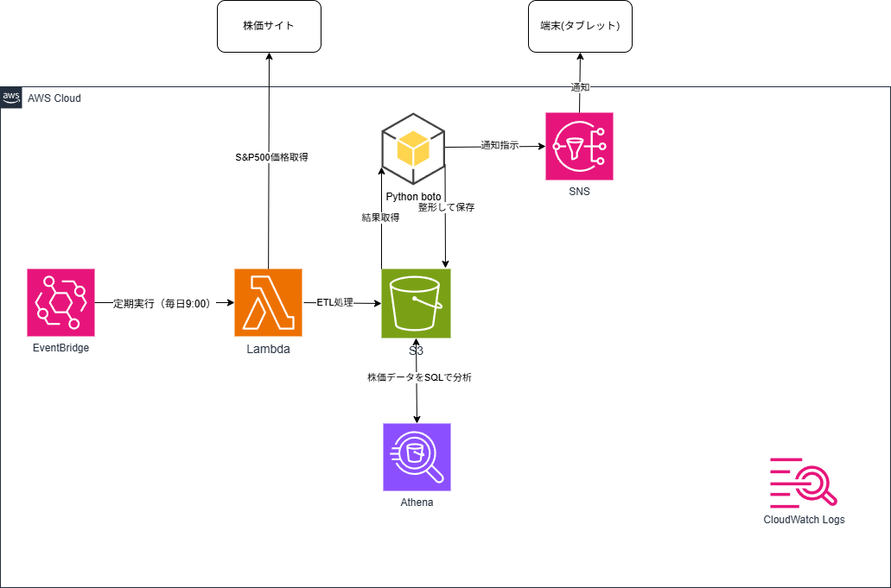

# aws-serverless-sp500-data-pipeline

AWSサーバーレスアーキテクチャ（Lambda / S3 / Athena / SNS / EventBridge）で構築したS&P500株価データ分析・通知システム。完全自動化されたデータパイプラインを実装。

---

## 概要（何を作ったか・目的）

S&P500（正確にはSPY ETF）の日次株価データを外部APIから取得し、分析・レポート生成・通知までを自動化するデータパイプラインをAWS上に構築しました。

Lambdaで外部APIから株価データを取得し、S3に保存。
AthenaでSQL分析を行い、結果を日本語レポートとして整形し、SNS（メール）で通知します。

本システムは完全サーバーレスで構成されており、EventBridgeによって毎日自動実行されます。

本プロジェクトの目的は以下です：

* サーバーレスアーキテクチャの理解
* データパイプライン（ETL）の実装
* AthenaによるSQL分析の実践
* EventBridgeによるバッチ自動化
* SNSによる通知システム構築
* AWSサービス連携設計の理解

---

## 構成 / アーキテクチャ



---

## 検証時の構成

* リージョン: ap-northeast-1（東京）
* 実行環境: AWS Lambda（Python 3.x）
* データ保存: Amazon S3
* クエリ: Amazon Athena
* 通知: Amazon SNS（Email）
* スケジュール: Amazon EventBridge
* 外部API: Alpha Vantage

---

## 使用技術

## AWS

* **AWS Lambda**

  * 株価取得 / データ整形 / Athena実行 / レポート生成

* **Amazon S3**

  * rawデータ保存
  * レポート保存
  * Athenaクエリ結果保存

* **Amazon Athena**

  * S3上のデータをSQLで分析

* **Amazon SNS**

  * 分析結果をメール通知

* **Amazon EventBridge**

  * 毎日決まった時間にLambdaを自動実行

* **AWS IAM**

  * Lambdaの実行権限管理

* **Amazon CloudWatch Logs**

  * Lambdaログ監視

---

## 設計・その他

* **draw.io**：構成図作成
* **GitHub**：ソースコード管理

---

## データパイプラインの流れ

```text
① EventBridge（9:05）
   ↓
② Lambda（株価取得）
   ↓
③ S3（raw）へ保存（JSON）

④ EventBridge（9:10）
   ↓
⑤ Lambda（Athena実行）
   ↓
⑥ SQL分析（平均終値）
   ↓
⑦ レポート整形（日本語）
   ↓
⑧ S3（report）へ保存
   ↓
⑨ SNS通知（メール）
```

---

## デプロイ方法

1. Lambda関数を作成（2つ）

   * 株価取得用
   * 分析・通知用

2. S3バケット作成

   * raw/
   * report/
   * athena-result/

3. Athenaテーブル作成

```sql
CREATE EXTERNAL TABLE sp500_data (
  date string,
  open double,
  high double,
  low double,
  close double,
  volume bigint
)
ROW FORMAT SERDE 'org.openx.data.jsonserde.JsonSerDe'
LOCATION 's3://sp500-portfolio-study/raw/';
```

4. SNSトピック作成＆メール登録

5. EventBridgeルール設定

   * 9:05 → データ取得
   * 9:10 → 分析・通知

---

## 実装機能

### 株価データ取得

* Alpha Vantage APIからSPYの株価を取得
* JSON形式でS3に保存

---

### データ分析（Athena）

* SQLで平均終値を算出

```sql
SELECT avg(close) AS avg_price FROM sp500_data;
```

---

### レポート生成

```json
{
  "日時": "2026年05月04日09時10分",
  "指標": "S&P500平均終値",
  "値": 684.39,
  "メッセージ": "2026年05月04日09時10分時点のS&P500平均終値は684.39ドルです"
}
```

---

### SNS通知

* メールで自動通知
* タブレットでも受信可能

---

## 工夫・学習したポイント

### 1. サーバーレス設計

EC2を使用せず、Lambdaとマネージドサービスのみで構成。
コスト効率と運用負担の削減を実現。

---

### 2. ETL処理の実装

* Extract：APIからデータ取得
* Transform：Lambdaで整形
* Load：S3へ保存

---

### 3. Athenaによる分析

データベースを用意せず、S3上のデータを直接SQL分析。
スキーマオンリードの理解。

---

### 4. 自動化（EventBridge）

完全自動バッチ処理を実現：

* 毎日データ取得
* 自動分析
* 自動通知

---

### 5. SNSによる通知設計

* トピックを利用した配信設計
* 複数デバイス対応（PC / スマホ / タブレット）

---

## 開発中に直面した課題と解決策

---

### ① SNS通知エラー（AuthorizationError）

**問題**

SNS publishでエラー

**原因**

IAMロールにSNS権限がなかった

**解決策**

```json
{
  "Effect": "Allow",
  "Action": "sns:Publish",
  "Resource": "*"
}
```

---

### ② ARN設定ミス

**問題**

Invalid parameter: TopicArn

**原因**

トピック名や余計なIDを指定していた

**解決策**

```text
arn:aws:sns:ap-northeast-1:アカウントID:トピック名
```

---

### ③ 文字コードエラー

**問題**

UnicodeEncodeError

**原因**

URLに日本語が含まれていた

**解決策**

英数字のみのURLを使用


## 今後の改善

* QuickSightでグラフ可視化
* 異常検知（前日比など）
* LINE通知対応
* データ蓄積によるトレンド分析

---

## 補足

本システムではS&P500指数そのものではなく、
それに連動するETF（SPY）を使用しています。

---

## まとめ

AWSの主要サーバーレスサービスを組み合わせ、

* データ取得
* データ分析
* レポート生成
* 通知
* 自動化

までを一貫して実装した実践的なプロジェクトです。
